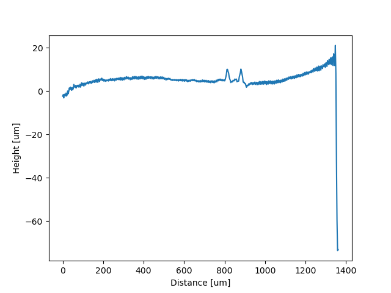

# Sensofar
The coode to read profiles from the surface of the 3d scan. The 3d scans can be read in any standard 3d format 
(.dat, .plux, .step).

## Usage 
Script removes the polynomial background using functionality from [pygwpy](http://gwyddion.net/documentation/user-guide-en/pygwy.html) module. Define the order of the polynomial to fit. Tell the script where the folder path is and it will process all files with given extension.
The output of the script is CSV files with x-coordinate defining the position and second column in profile depth measured by Sensofar corrected using substracted background.

## Example
The pygwpy module is available only for Python2.7 so install python2.7 as described in this page [Download gwyddion](http://gwyddion.net/download.php). Please, install 32-bit version for Windows to get python scripting, the 64-bit version is not supporting python scripting.

`
C:\Python27>.\python C:\Users\ivt\Documents\CODE\sensorfar\linescan.py
`  
`
Folder path : C:\Users\ivt\Documents\CODE\sensorfar\Linescan_tests_Sensofar # sets folder path  
`  
`
Polynomial order to remove : 3 
`  
`
Processing file:  C:\Users\ivt\Documents\CODE\sensorfar\Linescan_tests_Sensofar\full_line_high_res_1_um_demo.dat
...
`

## Results
The results are CSV-files with first column position along the line and second column the profile depth of the particular column of the 3d surface file. The datafield of the 3d file in Gwyddion program contains rows and columns 
of the data which contain the depth profile information. For our purpose we are only interested in the column data spaced by units internally saved inside the 3d file. The units can be retrived by [get_si_unit_xy()](http://gwyddion.net/documentation/head/pygwy/gwy.DataField-class.html#get_si_unit_xy) or [get_si_unit_z()](http://gwyddion.net/documentation/head/pygwy/gwy.DataField-class.html#get_si_unit_xy).

### Example Profile
